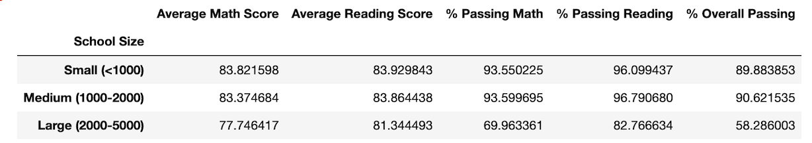

# Cheating The System?

## Overview of School District Analysis
I previously performed an analysis of the math and reading scores from several high schools in the area to calculate the amount and the percentage of passing reading and math scores and to determine if the amount of spending per student, the size of the school or the type of school affect those scores, which may help the school board budget in the future. However, the school board suspects that there may be academic dishonesty in some of the grades that were included in that previous school district analysis. The ninth grade math and reading scores from Thomas High School look suspicious so Maria has asked me to perfrom a new analysis. To perform this analysis, I will replace those scores with NaNs and perform the analysis again to see if there are any affects on the results.

---
## Results
* Replacing the scores of the ninth graders from Thomas High School did not have much of an affect on the district summary. The original analysis calculated the following results for the district summary:

    

    Meanwhile, the new district summary revealed only slightly worse results for the average math score, average reading score, percentage of students passing math, percentage of student passing reading and the overall percentage of students passing (percentage of students passing both math and reading):

    

    The average math scores for the district in the new analysis were only about five hundredths lower than the original analysis and the average reading scores were only about two hundredths lower. Additionally, the percentage of students passing math, the percentage of students passing reading and the overall passing percentage were only about two tenths, one and a half tenths and three tenths lower, respectively. Overall, removing the ninth grade scores from Thomas High School did lower the results slightly but not to a significant degree.
---
* The original per school summary produced these results:

    

    Removing the ninth grade scores did produce an interesting result on the scores for Thomas High School:

    

    Specifically, the average reading score for Thomas High School was actually five tenths higher in the new analysis. The average math score, on the other hand, was only about seven hundredths lower.

    Moreover, the passing rates for Thomas High School were slightly lower. While the percentage of students passing math was about nine hundredths lower, the percentage of students passing reading and the overall passing percentages were both about three tenths lower.
---
* In the original analysis, the top 5 performing schools in passing both math and reading were Cabrera, Thomas, Griffin, Wilson, and Pena high schools:

    

    While the overall passing percentage for Thomas High School was lower, removing the ninth grade scores did not have an effect on Thomas High School's standing among the top schools:

    

    Thomas High School is still the second highest rated high school for passing both math and reading, with only Cabrera High School being ahead. What did change, however, was that Thomas High School went from having a passing reading rate that was almost three tenths higher than Cabrera High School to having a rate that was just over two hundredths lower in the new analysis. 
---
* #### Math And Reading Scores By Grade
    The math and reading scores for all the schools, including the tenth through twelfth grade scores for Thomas High School, are not affected by removing the ninth grade scores since those scores are not included in the data set of all the other scores. 
    
    ---
    #### Scores By School Spending
    In terms of spending, the new analysis only shows a change in the results for schools spending $631-$645 per student since Thomas High School spends $638 per student. The original analysis produced these results:

    

    The new analysis showed an interesting result:

    

    While the average math score and the passing rates are all lower, the average reading score for schools that spend between $631 and $645 is actually just over one hundredths higher after removing the ninth grade scores.

    ---
    #### Scores By School Size
    Comparing the results for school sizes, revealed a similar finding to the results for school spending. The orginal size summary is divided into categories for schools with less than 1000 students, schools with 1000 to 2000 students and schools with 2000 to 5000 students:

    

    The new analysis showed that the average reading score for schools between 1000 and 2000 students is actually about nine thousandths higher after removing the ninth grade scores:

    

    ---
    #### Scores By School Type
    For the comparison of the scores by type of school, the orignal analysis is divided into categories for charter schools and district schools:

    

    Similarly, since Thomas High School is a charter school, the results in the new analysis revealed that the average reading score for charter schools is about five thousandths higher:

    

---
## Summary
Removing the math and reading scores for the ninth graders at Thomas High School and replacing them with NaNs lowered the average math scores and the passing rates in all the updated summaries for the new analysis. However, there were four important changes. The average reading scores were actually higher for Thomas High School in the new per school summary, the new spending summary, the new school size summary and the new school type summary, which is the opposite of what one would expect if there were academic dishonesty in the scores. This interesing result seems to show that there might not be any academic dishonesty at Thomas High School since the average reading score was actually lower before the removal of the ninth grade scores. 